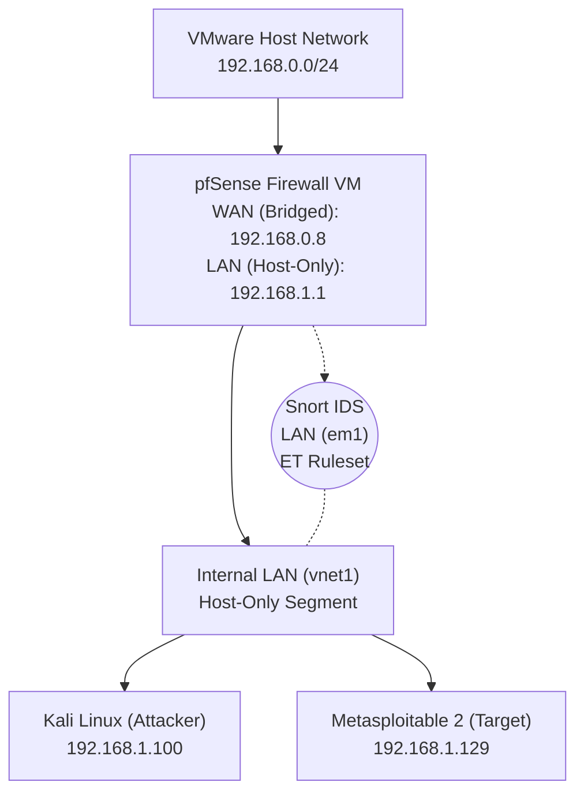

# lab-pfsense-snort-ids

**Perimeter defense and intrusion detection lab: pfSense firewall + Snort IDS validated against Kali Linux adversary emulation (Nmap reconnaissance + Metasploit `vsftpd_234_backdoor` exploitation) targeting a Metasploitable 2 server.**

    

---

## Scenario

*Aperture Financial* (simulated mid-size financial services firm) is preparing for its first major regulatory audit and must demonstrate effective monitoring and threat detection. A small-scale replica of the production network was built to validate whether a newly implemented pfSense firewall and Snort IDS would (1) detect realistic cyber-attack activity, (2) protect sensitive client data, and (3) satisfy regulatory expectations for continuous monitoring.

## Objectives

- Build a reproducible three-VM virtual network in VMware Workstation Pro 17.
- Deploy pfSense as the perimeter firewall and gateway with WAN/LAN segmentation.
- Install and configure Snort (LAN interface) with Emerging Threats (ET) rulesets.
- Simulate realistic attacker activity from a Kali Linux workstation.
- Verify detection fidelity across reconnaissance, scanning, and exploitation phases.
- Capture evidence suitable for an audit or compliance review.

---

## Architecture



See [`diagrams/topology.mmd`](diagrams/topology.mmd) for the source diagram.

---

## Lab Environment

| Component | Version / Spec | Role |
|---|---|---|
| VMware Workstation Pro | 17 | Hypervisor |
| pfSense | CE latest | Perimeter firewall + Snort host |
| Kali Linux | Rolling | Attacker workstation |
| Metasploitable 2 | 2.0.0 | Intentionally vulnerable target |
| Snort | 2.9.x via pfSense pkg | Network IDS |
| Rulesets | Emerging Threats (ET) Open | Detection signatures |

### Network Plan

| Interface | VMware Network Type | IP / CIDR | Purpose |
|---|---|---|---|
| pfSense WAN | Bridged (Adapter 1) | 192.168.0.8/24 | Upstream / external-facing |
| pfSense LAN | Host-Only `vnet1` (Adapter 2) | 192.168.1.1/24 | Internal gateway |
| Kali LAN | Host-Only `vnet1` | 192.168.1.100/24 | Attacker workstation |
| Metasploitable LAN | Host-Only `vnet1` | 192.168.1.129/24 | Vulnerable asset |

---

## Reproduction Steps

### 1. Build the virtual network
1. Install VMware Workstation Pro 17 on the host.
2. Create a host-only network (`vnet1`) with DHCP disabled so pfSense controls addressing on 192.168.1.0/24.
3. Provision the three VMs (pfSense, Kali, Metasploitable 2) with the NIC configuration in the *Network Plan* above.

### 2. Configure pfSense
1. Boot the pfSense installer ISO; complete the installer defaults.
2. Assign WAN to Adapter 1 (bridged) and LAN to Adapter 2 (host-only `vnet1`).
3. In the pfSense web UI (`https://192.168.1.1`):
   - Navigate to **Firewall → Rules → WAN**.
   - Verify **Block private networks (RFC1918)** and **Block bogon networks** are enabled on WAN (see [`configs/firewall-rules-wan.md`](configs/firewall-rules-wan.md)).
4. Install the Snort package from **System → Package Manager**.

### 3. Configure Snort
1. Navigate to **Services → Snort → Global Settings** and enable Emerging Threats Open ruleset updates.
2. Under **Updates**, fetch the latest ET signatures.
3. Under **Interfaces**, add the **LAN** interface with:
   - Pattern Match: `AC-BNFA`
   - Blocking Mode: `Disabled` (IDS mode only)
   - Send Alerts to System Log: `Enabled`
   - System Log Facility: `LOG_AUTH`
   - System Log Priority: `LOG_ALERT`
4. Under **LAN Categories**, enable Emerging Threats rule categories relevant to scanning, exploit, and policy violations (see [`configs/snort-interface-lan.md`](configs/snort-interface-lan.md)).
5. Restart Snort on the LAN interface and confirm status is **running** in **Snort Interfaces**.

### 4. Validate connectivity
From Kali:
```bash
ping -c 4 192.168.1.1     # pfSense LAN gateway
ping -c 4 192.168.1.129   # Metasploitable 2
ping -c 4 8.8.8.8         # Upstream DNS via pfSense WAN
```

### 5. Run adversary emulation
From Kali, execute the phases in [`configs/attack-playbook.md`](configs/attack-playbook.md):
- Reconnaissance — `nmap -sV -O 192.168.1.129`
- Service enumeration — `nmap --script vuln 192.168.1.129`
- Exploitation — Metasploit `exploit/unix/ftp/vsftpd_234_backdoor` against 192.168.1.129:21

### 6. Review Snort alerts
1. In pfSense, navigate to **Services → Snort → Alerts → Interface to Inspect: LAN (em1)**.
2. Filter by `ET SCAN` to view scan detections.
3. Filter by `ET POLICY` to view policy violations (e.g., Kali hostname in DHCP).
4. Filter by `ftp_telnet` and `http_inspect` to view exploitation-phase alerts.
5. Export the alert log via the **Download** action for evidence retention.

---

## Results

Snort generated **88+ alerts** across three attack phases, producing verifiable evidence that the IDS is detecting hostile activity on the internal segment:

| Attack Phase | Technique | Snort Signature(s) | Priority |
|---|---|---|---|
| Reconnaissance | Nmap service scan from 192.168.1.100 → 192.168.1.129 | `ET SCAN Possible Nmap User-Agent Observed` (SID 1:2024364) | 1 |
| Host fingerprinting | Kali DHCP request broadcast | `ET POLICY Possible Kali Linux hostname in DHCP Request Packet` (SID 1:2022973) | 1 |
| Exploit attempt (FTP) | Metasploit `vsftpd_234_backdoor` → port 21 | `(ftp_telnet) Invalid FTP Command` (GID 125:2) | 2 |
| Post-exploit traffic | Shell over 192.168.1.100:6200 | `(http_inspect) INVALID CONTENT-LENGTH OR CHUNK SIZE` (GID 120:8) | 3 |

**Key finding:** Although the `vsftpd_234_backdoor` exploit returned an interactive shell (demonstrating the need for host-level controls), **Snort successfully logged every phase of the intrusion**, producing the continuous-monitoring evidence required for audit. Representative alert screenshots are in [`evidence/`](evidence/).

---

## Business Impact

Deploying pfSense + Snort at Aperture Financial delivered four measurable improvements relevant to a financial-sector regulatory audit:

1. **Continuous monitoring evidence** — exportable alert logs satisfy control expectations for evidence of network surveillance.
2. **Early-phase detection** — reconnaissance was caught before exploitation, reducing dwell time.
3. **Cost-effective scalability** — both tools are open source and can be extended to additional segments without material infrastructure cost.
4. **Defensible audit narrative** — alerts are tied to Emerging Threats signatures with public provenance, which auditors and examiners can independently verify.

### Recommendation

Expand pfSense + Snort to all critical network segments, migrate Snort to blocking mode (IPS) on WAN for high-confidence signatures, and pipe `LOG_AUTH` alerts to a central SIEM for correlation and long-term retention.

---

## Skills Demonstrated

- Network architecture and segmentation (WAN/LAN, host-only virtual networking)
- Perimeter firewall configuration (pfSense rules, RFC1918/bogon filtering)
- Network IDS deployment and tuning (Snort on pfSense, ET rulesets, SID management)
- Adversary emulation (Nmap, Metasploit Framework)
- Alert triage and evidence collection
- Mapping detection outcomes to audit / regulatory requirements

---

## Repository Layout

```
lab-pfsense-snort-ids/
├── README.md                  ← this file
├── LICENSE                    ← MIT
├── .gitignore
├── configs/
│   ├── firewall-rules-wan.md  ← WAN rule-set reference
│   ├── snort-interface-lan.md ← Snort LAN interface settings
│   └── attack-playbook.md     ← Kali → Metasploitable attack steps
├── diagrams/
│   └── topology.mmd           ← Mermaid source for architecture diagram
├── evidence/
│   └── README.md              ← index of alert screenshots
└── docs/
    └── report.pdf             ← sanitized full write-up
```

---

## References

- Netgate. *pfSense software: Download.* <https://www.pfsense.org/download/>
- Kali Linux. *Get Kali.* <https://www.kali.org/get-kali/#kali-platforms>
- Rapid7. *Metasploitable.* <https://www.rapid7.com/products/metasploit/metasploitable/>
- VMware. *Workstation Pro.* <https://www.vmware.com/products/desktop-hypervisor/workstation-and-fusion>
- Proofpoint. *Emerging Threats Open rulesets.* <https://rules.emergingthreats.net/>
- Snort. *Snort IDS/IPS documentation.* <https://docs.snort.org/>

---

## License

MIT — see [LICENSE](LICENSE).
# lab-pfsense-snort-ids
